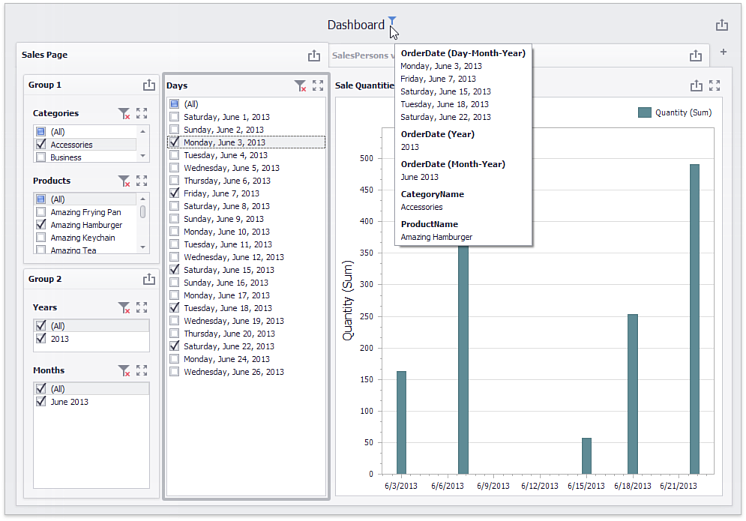

# How to Create a Cascading Lookup Filter and Apply it Across Tab Pages and Data Sources

This example demonstrates a dashboard that implements the cascading filter functionality extended across tab pages and applied to different data sources.

The following techniques are employed:

* [master filter](https://docs.devexpress.com/Dashboard/15702/creating-dashboards/creating-dashboards-in-the-winforms-designer/interactivity/master-filtering) settings used to create a [cascading lookup filter](https://docs.devexpress.com/Dashboard/400444/creating-dashboards/creating-dashboards-in-the-winforms-designer/interactivity/cascading-lookup);
* [tab page](https://docs.devexpress.com/Dashboard/400237/creating-dashboards/creating-dashboards-in-the-winforms-designer/designing-dashboard-items/tab-container) interactivity settings to isolate master filter items;
* [master filter settings](https://docs.devexpress.com/Dashboard/15702/creating-dashboards/creating-dashboards-in-the-winforms-designer/interactivity/master-filtering#master-filter-settings) applied to different data sources.

The dashboard is shown below.

